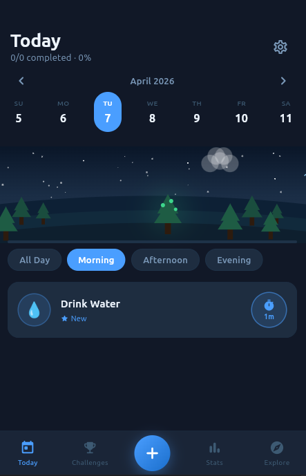
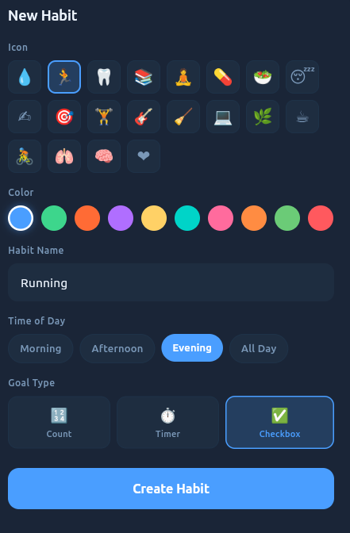
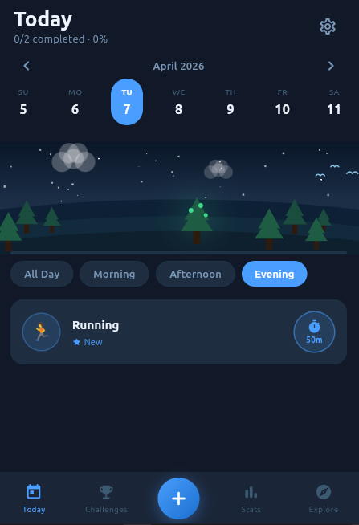
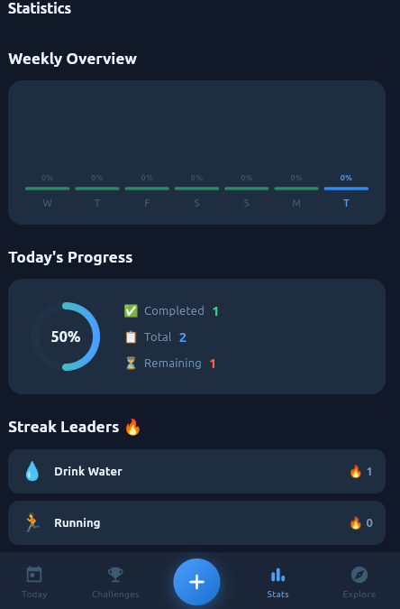
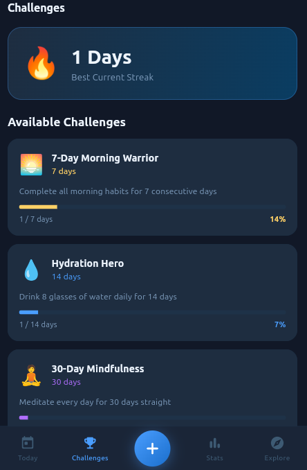
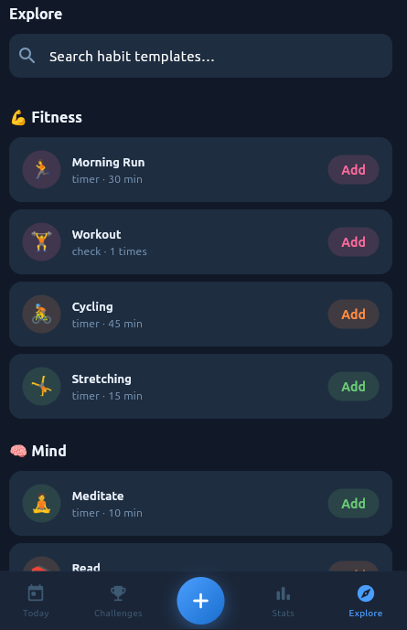

# Habit Tracker

A Flutter habit tracker with daily streaks, time-of-day filtering, a nature progress scene, and full local SQLite persistence — no backend required.

---

## Screenshots

| # | Screen | Description |
|---|--------|-------------|
| 1 |  | Today screen — date header, nature scene, progress bar, and habit list |
| 2 |  | Bottom sheet for creating a habit: icon, color, goal type, and time of day |
| 3 |  | Habit card in progress — timer/count stepper with animated fill ring |
| 4 |  | Stats screen — weekly bar chart, today's ring, and streak leaderboard |
| 5 |  | Challenges screen — best-streak hero card and progress cards |
| 6 |  | Explore screen — categorised habit templates with one-tap add |

---

## Features

- **Daily Habit List** — Filtered by morning / afternoon / evening / all, with a calendar strip for past-date review
- **Goal Types** — `check` (done/not done), `count` (e.g. 8 glasses), and `timer` (e.g. 30 min) each render a different interaction on the habit card
- **Streak Tracking** — Consecutive-day streaks calculated per habit and surfaced in a leaderboard and the Challenges screen
- **Nature Scene** — Animated ambient background (sun/moon, clouds, grass) whose progress bar fills as habits are completed
- **30-Day Heatmap** — Per-habit coloured grid showing completion history at a glance
- **Weekly Bar Chart** — Completion-percentage bars for the last 7 days with today highlighted
- **Explore Templates** — 16 curated habit templates across Fitness, Mind, Health, and Productivity; one tap adds to your list
- **Local SQLite Persistence** — All habits and entries stored on-device via `sqflite` / `sqflite_common_ffi` (desktop-compatible)
- **Riverpod State** — Full reactive state with `AsyncNotifier` providers; UI rebuilds only what changed

---

## Tech Stack

| Layer | Package |
|-------|---------|
| Framework | Flutter (Dart) |
| State Management | `flutter_riverpod ^2.5` |
| Local Database | `sqflite ^2.3` + `sqflite_common_ffi ^2.3` |
| Routing / Path | `path ^1.9` |
| IDs | `uuid ^4.4` |
| Date Formatting | `intl ^0.19` |
| Icons | Material Icons |

---

## Getting Started

```bash
# 1. Clone the repo
git clone https://github.com/ruperthjr/flutter_habit_tracker.git
cd flutter_habit_tracker

# 2. Install dependencies
flutter pub get

# 3. Run (Linux desktop, Android, iOS, or Chrome)
flutter run
```

Minimum Flutter SDK: **3.19.0**

> **Desktop note:** The app initialises `sqflite_common_ffi` automatically on Linux, Windows, and macOS — no extra setup needed.

---

## Project Structure

```
lib/
├── main.dart                         # Entry point — ProviderScope + FFI init
├── core/
│   ├── database/
│   │   └── database_helper.dart      # Singleton SQLite open/create
│   └── theme/
│       └── app_theme.dart            # Dark ThemeData + colour palette
└── features/
    └── habits/
        ├── data/
        │   └── habit_repository.dart # All SQL queries (CRUD + streaks + stats)
        ├── domain/
        │   └── models.dart           # Habit, HabitEntry, GoalType, HabitTime
        └── presentation/
            ├── providers.dart        # Riverpod providers (habits, entries, stats)
            └── screens/
            │   ├── main_screen.dart       # IndexedStack + bottom nav + FAB
            │   ├── today_screen.dart      # Daily list with calendar strip
            │   ├── stats_screen.dart      # Charts, ring, heatmap
            │   ├── challenges_screen.dart # Streak challenges
            │   └── explore_screen.dart    # Template browser
            └── widgets/
                ├── add_habit_sheet.dart   # Create / edit habit bottom sheet
                ├── habit_card.dart        # Per-goal interactive card
                ├── calendar_strip.dart    # Horizontal date picker
                ├── time_filter_bar.dart   # Morning/Afternoon/Evening/All chips
                ├── nature_scene.dart      # Animated ambient scene
                └── streak_badge.dart      # Flame badge overlay
```

---

## Database Schema

| Table | Key Columns |
|-------|-------------|
| `habits` | `id TEXT PK`, `name`, `icon`, `color`, `time_of_day`, `goal_type`, `goal_value`, `unit`, `sort_order`, `is_active` |
| `habit_entries` | `id TEXT PK`, `habit_id FK`, `date TEXT`, `progress`, `is_completed`, `completed_at` |

Index: `idx_entries (habit_id, date)` for fast daily lookups.

---

## License

MIT — see [LICENSE](./LICENSE)